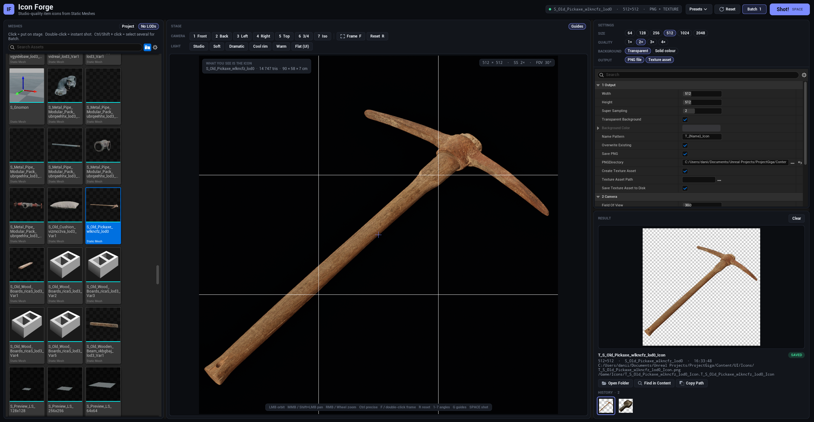

<div align="center">


# Icon Forge

**Studio-quality item icons from Static Meshes, right inside Unreal Engine 5.**

Orbit camera · 3-point lighting presets · transparent background · PNG + UI textures · batch rendering


[](https://dalink.to/coreveldev)

<a href="https://dalink.to/coreveldev"></a>

[English](#-features) · [Русский](#-по-русски)

<!-- Replace with your own screenshot / GIF: docs/screenshot.png -->


</div>

---

## ✨ Features

| | |
|---|---|
| 🎯 **What you see is the icon** | The stage viewport has exactly the aspect ratio of your icon. Framing in the viewport = framing in the file. |
| 🎥 **Orbit camera** | Smooth orbit / pan / zoom, precise mode with Ctrl, 7 camera presets (Front, Back, Left, Right, Top, 3/4, Isometric). |
| 💡 **Lighting presets** | Studio, Soft, Dramatic, Cool rim, Warm, Flat (UI). Key / Fill / Rim lights follow the camera. |
| 🫥 **Real transparency** | Clean alpha with no dark fringes (premultiplied downscale), or any solid background colour. |
| 🔍 **Supersampling** | Render up to 4× bigger and downscale for smooth edges. |
| 💾 **Two outputs** | `.png` files and/or ready-to-use **UI Texture2D** assets (`TC_EditorIcon`, `TEXTUREGROUP_UI`, no mips). |
| 📦 **Batch** | Select dozens of meshes, press **Batch**, get dozens of consistent icons. |
| 🎛️ **Presets** | Save and load all settings as named JSON presets. The session is autosaved. |
| 🖱️ **Content Browser integration** | Right-click one or many Static Meshes → **Icon Forge: Make Icon(s)**. |

## 🚀 Installation

1. Download the latest release (or clone this repo).
2. Copy the `IconForge` folder to `<YourProject>/Plugins/`:
   ```
   YourProject/
   └── Plugins/
       └── IconForge/
           └── IconForge.uplugin
   ```
3. Right-click `YourProject.uproject` → **Generate Visual Studio project files**.
4. Build `Development Editor | Win64` and open the editor.

> **Note:** a C++ project is required. Blueprint-only project? Add any C++ class once (Tools → New C++ Class) to convert it.

## 🧭 Usage

1. **Tools → Icon Forge** (or right-click a Static Mesh → *Icon Forge: Make Icon*).
2. Click a mesh in **MESHES**: it appears on the **STAGE**.
3. Choose an angle (mouse or keys `1`–`7`) and a light preset.
4. Set size / background / outputs in **SETTINGS**.
5. Press **Shot!** or `Space`. The icon appears in **RESULT**.

### ⌨️ Controls

| Input | Action |
|---|---|
| `LMB` drag | Orbit |
| `MMB` / `Shift + LMB` drag | Pan |
| `RMB` drag / Wheel | Zoom |
| `Ctrl` (held) | Precise movement |
| `F` / double-click | Frame object |
| `R` | Reset to 3/4 view |
| `1`–`7` | Camera presets |
| `G` | Toggle guides |
| `Space` / `Enter` | **Shot!** |

### 📁 Where files go

| What | Default location |
|---|---|
| PNG icons | `<Project>/Saved/Icons` |
| Texture assets | `/Game/Icons` |
| Session (autosave) | `<Project>/Saved/IconForge/Session.json` |
| Presets | `<Project>/Saved/IconForge/Presets/*.json` |

Name pattern tokens: `{Name}`, `{BaseName}` (without `SM_` / `S_`), `{W}`, `{H}`. Default: `T_{Name}_Icon`.

## 🧩 Compatibility

| Engine | Status |
|---|---|
| UE 5.x (TODO: your exact version) | ✅ Tested |
| Other UE 5 versions | ❓ Not tested yet, reports welcome |

Editor-only plugin: nothing is added to your packaged game.

## 🛠️ Troubleshooting

<details>
<summary><b>LNK2019 / unresolved external after updating the plugin</b></summary>

Delete `Plugins/IconForge/Binaries` and `Plugins/IconForge/Intermediate`, regenerate project files and build again. Always replace the plugin folder fully instead of copying over the old one.
</details>

<details>
<summary><b>Icon looks blurry or has missing textures</b></summary>

Icon Forge waits for shader and texture compilation, but with very heavy projects try pressing Shot! once more after the editor finished compiling shaders.
</details>

<details>
<summary><b>My engine / plugin meshes are not in the list</b></summary>

Turn off the **Project** chip in the MESHES panel.
</details>

## 💛 Support the project

Icon Forge is free. If it saved you time, you can support development on **DonationAlerts**.
The **Donate** button in the plugin header opens the same page.

<table>
<tr>
<td align="center">
<a href="https://dalink.to/coreveldev"></a><br/>
<a href="https://dalink.to/coreveldev"><b>dalink.to/coreveldev</b></a>
</td>
<td align="center">
<br/>
<sub>Scan to donate</sub>
</td>
</tr>
</table>

## 🤝 Contributing

Issues and pull requests are welcome. Please mention your engine version and attach the Output Log for bugs.

## 📄 License

[MIT](LICENSE) © TODO: your name

---

## 🇷🇺 По-русски

**Icon Forge** — плагин редактора UE5 для создания иконок предметов из Static Mesh: камера-орбита, пресеты света, прозрачный фон, PNG и UI-текстуры, пакетный рендер.

**Установка:** скопируйте папку `IconForge` в `<Проект>/Plugins/`, сгенерируйте project files, соберите `Development Editor`.

**Использование:** *Tools → Icon Forge* → выберите меш → настройте ракурс и свет → **Shot!** (Пробел). Несколько мешей: Ctrl/Shift + клик → **Batch**.

Подробности: [QUICKSTART_RU.md](QUICKSTART_RU.md).

**Поддержать проект:** [dalink.to/coreveldev](https://dalink.to/coreveldev) (DonationAlerts), QR-код выше. Кнопка **Donate** есть и в шапке самого плагина.
